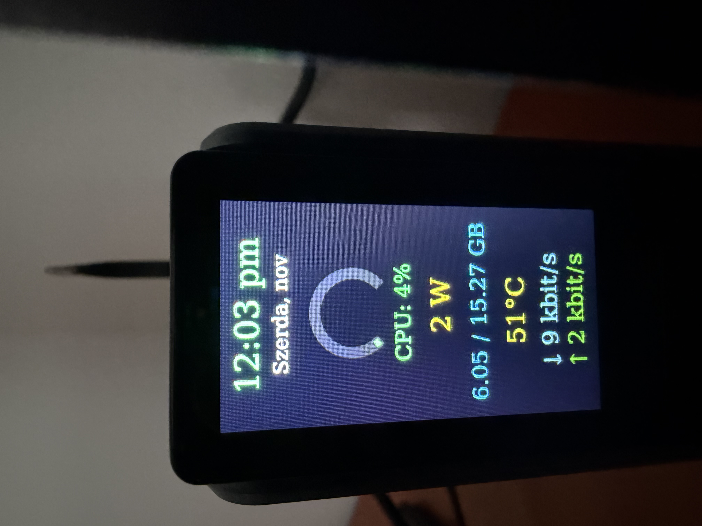

# AceMagic S1 LED + TFT Panel (Synology / SZBOX verzió)

Ez a projekt az [**tjaworski/AceMagic-S1-LED-TFT-Linux**](https://github.com/tjaworski/AceMagic-S1-LED-TFT-Linux/tree/main) módosított változata,  
kifejezetten **Synology NAS (DSM 7.2+)** rendszerekre és **SZBOX mini PC** használatra optimalizálva.



A módosítások célja, hogy a kijelző és LED vezérlés stabilan működjön NAS környezetben,  
valamint automatikusan induljon rendszerindításkor.

---

## ⚙️ Telepítési lépések (Synology / SZBOX alatt)

### 1️⃣ Node.js telepítése
Telepítsd a Node.js csomagot DSM-ben vagy terminálon:

```bash
sudo apt install nodejs npm -y

Ellenőrizd a verziót:
node -v

2️⃣ Projekt letöltése / másolása

Másold a projektet a homes könyvtáradba:
mkdir -p /volume1/homes/xxxuser/AceMagic-S1-Panel
cp -r /root/AceMagic-S1-LED-TFT-Linux-main/s1panel/. /volume1/homes/xxxuser/AceMagic-S1-Panel/
chown -R xxxuser:users /volume1/homes/xxxuser/AceMagic-S1-Panel

3️⃣ Függőségek telepítése

cd /volume1/homes/xxxuser/AceMagic-S1-Panel
npm install

4️⃣ Szolgáltatás létrehozása (automatikus indulás)

sudo vi /etc/systemd/system/s1panel.service

[Unit]
Description=AceMagic S1 Panel Display
After=network.target

[Service]
ExecStart=/usr/local/bin/node /volume1/homes/xxxuser/AceMagic-S1-Panel/main.js
WorkingDirectory=/volume1/homes/xxxuser/AceMagic-S1-Panel
Restart=always
User=root

[Install]
WantedBy=multi-user.target

Mentés után:

sudo systemctl daemon-reload
sudo systemctl enable s1panel.service
sudo systemctl start s1panel.service
sudo systemctl status s1panel.service

5️⃣ LED konfiguráció

"led_config": {
  "device": "/dev/ttyUSB0",
  "theme": 2,
  "speed": 2,
  "intensity": 3
}

6️⃣ Hasznos parancsok

node main.js

RAM szenzor:

node -e "(async()=>{const m=require('./sensors/memory');m.init({});await new Promise(r=>setTimeout(r,1000));console.log(await m.sample(1000,'{12}% | {14} / {10} GB'));})();"

CPU teljesítmény:

node -e "require('./sensors/cpu_power').sample(1000,'{0} W').then(console.log)"

Ha a /sys/class/powercap/ nem elérhető, a rendszer automatikusan becsli a teljesítményt a CPU terhelés alapján.

 Különbségek az eredeti projekthez képest

• Synology-kompatibilis útvonalak
• CPU power fallback mód (powercap nélkül)
• RAM szenzor javítva és pontosítva (GB)
• Magyar dátum + 24 órás óraformátum
• Automatikus indulás systemd szolgáltatásként

⚠️ Megjegyzés

Ez a verzió kifejezetten Synology vagy SZBOX rendszerekhez készült.
Más Linux disztribúción működhet, de a /sys/class/powercap/ hiánya pontatlan mérést eredményezhet.

 Eredeti projekt

Forrás: tjaworski/AceMagic-S1-LED-TFT-Linux

⚡ Powered by AppSysCode

© Parti Albert – 2025
Synology NAS port & optimalizálás
